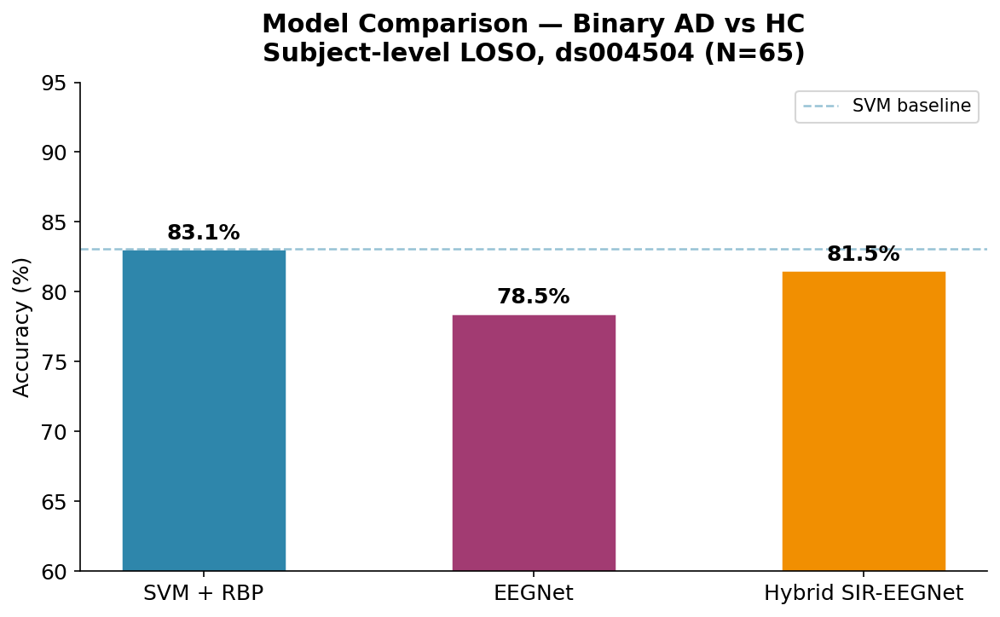
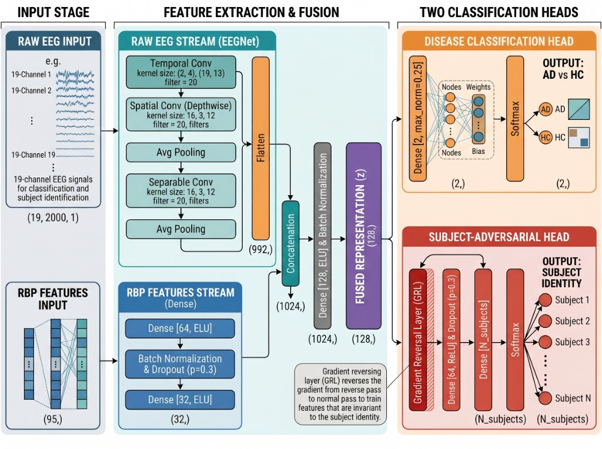
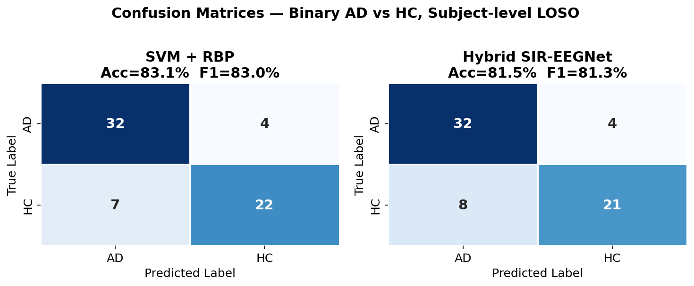
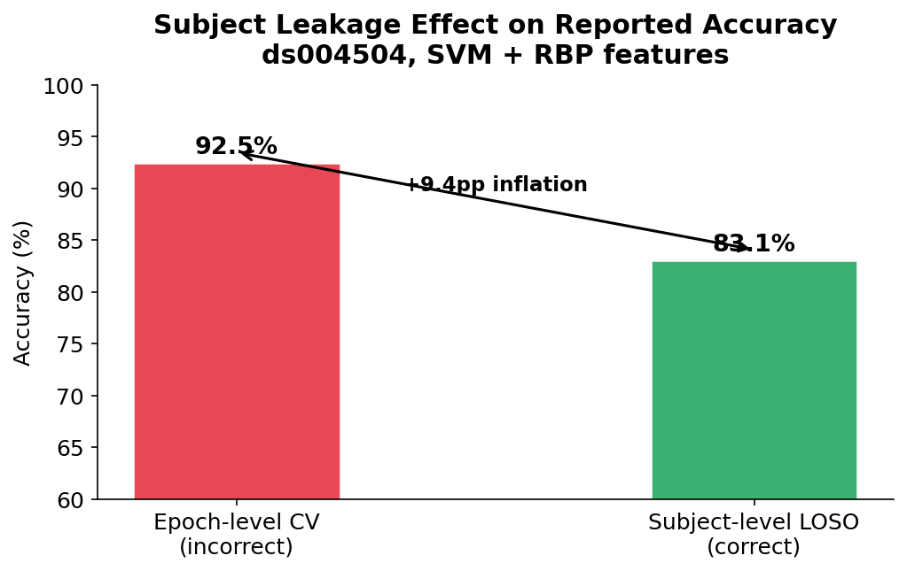

  <h1>🧠 EEG-Based Alzheimer's Disease Detection</h1>
  
  

    <strong>Robust Classification of Alzheimer's Disease using Resting-State EEG under Strict Subject-Level Evaluation</strong>
  

  
  
  
  
  

 

> **Research conducted under the supervision of Prof. Kang-Ming Chang, National Kaohsiung University of Science and Technology (NKUST), Taiwan.**

---

## 🔬 Overview

This repository contains a complete, research-grade pipeline for the **binary classification of Alzheimer's disease (AD) versus healthy controls (HC)** using 19-channel resting-state EEG signals.

A critical contribution of this work is addressing the widespread issue of **epoch-level data leakage** in EEG-AD literature. We demonstrate that standard epoch-level evaluation artificially inflates accuracy by ~9.4 percentage points. To ensure clinical validity, all models in this repository are evaluated under a strict **subject-level Leave-One-Subject-Out (LOSO)** cross-validation protocol.

*Figure 1: Comparison of baseline models and the proposed Hybrid SIR-EEGNet.*

---

## 🏗️ Model Architecture: Hybrid SIR-EEGNet

We propose the **Hybrid SIR-EEGNet**, which integrates:
1. **EEGNet Backbone**: For spatial-temporal feature learning directly from raw EEG.
2. **Relative Band Power (RBP) Branch**: Explicitly encoding known clinical AD biomarkers.
3. **Gradient Reversal Layer (GRL)**: For subject-adversarial training.

Following Ganin et al. (2016), the GRL forces the shared feature extractor to learn disease-relevant representations that are robust and invariant to subject-specific noise.

*Figure 2: Schematic of the proposed Hybrid SIR-EEGNet architecture containing the EEGNet stream, RBP feature projection, feature concatenation, and dual prediction heads (disease classification and subject-adversarial GRL).*

*Figure 3: Confusion Matrices displaying the robust predictive power on AD subjects.*

---

## 📊 Key Results

Binary classification on the OpenNeuro ds004504 dataset (N=65), employing rigorous subject-level LOSO:

| Model | Accuracy | F1 (W) | AD Recall |
|---|---|---|---|
| **SVM + RBP** | 83.1% | 83.0% | 88.9% |
| **EEGNet** | 78.5% | — | — |
| **Hybrid SIR-EEGNet** | **81.5%** | **81.3%** | **88.9%** |

*Figure 4: Demonstration of accuracy inflation due to data leakage in epoch-level CV.*

> **For a detailed breakdown of our findings, including cross-dataset generalization metrics, please see our [Results Documentation](results.md).**

---

## 📚 Project Documentation

We have modularized our documentation for deeper technical dives:

- 📖 [**Methodology**](methodology.md): Detailed explanation of our LOSO protocol, preprocessing pipeline, and feature extraction.
- 📈 [**Results**](results.md): Comprehensive metrics, statistical tests, and cross-dataset evaluations (FSU, ADSZ).
- 🗄️ [**Datasets**](datasets.md): Information regarding the primary and external datasets utilized in this research.

---

## 📓 Notebooks

Our pipeline is organized sequentially into Jupyter Notebooks:

| # | Notebook | Description |
|---|----------|-------------|
| 1 | `01_data_exploration` | Dataset loading, Exploratory Data Analysis (EDA), and DTABR biomarker analysis. |
| 2 | `02_svm_baseline_loso` | SVM + RBP features, strict LOSO evaluation. |
| 3 | `03_eegnet_loso` | EEGNet baseline under LOSO evaluation. |
| 4 | `04_sir_eegnet_loso` | Hybrid SIR-EEGNet model training and evaluation (ds004504). |
| 5 | `05_SIREEGNet_CrossDataset_ADSZ` | Hybrid SIR-EEGNet cross-dataset testing on the ADSZ dataset. |
| 6 | `06_SIREEGNet_CrossDataset_FSU` | Hybrid SIR-EEGNet cross-dataset testing on the FSU dataset. |

---

## ⚙️ Requirements

- Python 3.9+
- MNE-Python, PyTorch, scikit-learn, scipy, numpy, pandas, matplotlib, seaborn

---

## 📝 Citation

If you use this code, please cite the primary dataset:

> Miltiadous et al. (2023). A Dataset of Scalp EEG Recordings of Alzheimer's Disease, Frontotemporal Dementia and Healthy Subjects. *Data, 8(6), 95*.

---

## 🙏 Acknowledgements

This research was conducted at the **Department of Computer and Communication Engineering, National Kaohsiung University of Science and Technology, Taiwan**.